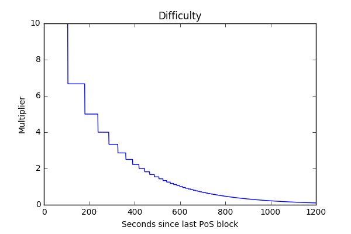
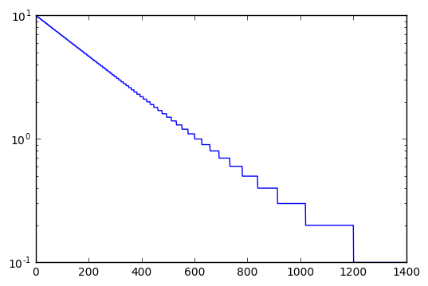

# Exponential PoS Target for Block Time Stabilization

- Status: proposed
- Type: enhancement
- Related components: `protocol`
- Start Date: 04-January-2017
- Discussion: (fill me in with link to RFC discussion - shepherd will complete this)

## Summary
Stabilizing the Proof-of-Stake block timing by multiplying the hash target using an exponential function of seconds since the last PoS block.

## Conventions
- The key words "MUST", "MUST NOT", "REQUIRED", "SHALL", "SHALL NOT", "SHOULD", "SHOULD NOT", "RECOMMENDED", "MAY", and "OPTIONAL" in this document are to be interpreted as described in [RFC 2119](http://tools.ietf.org/html/rfc2119).
- The verb "TO STAKE" or "STAKING" refers to the action of trying to create a Block using Proof-of-Stake.

## Motivation
Due to the nature of Peercoin's Proof-of-Stake algorithm, large variations in time between Proof-of-Stake blocks exist.
Large holders tend to mint their coins periodically and start staking at low difficulty, producing blocks at a much higher rate than intended.
After all the large holder's coins successfully minted, the Proof-of-Stake targed is raised significantly leading to block timings much larger than intended until the difficulty has settled again.
This behavior restults in unpredictable confirmation times and therefore compromises the reliability and usability of transactions on the peercoin blockchain.

Unlike the the Proof-of-Work scheme, the Proof-of-Stake scheme is coupled to the network time.
This property allows for a much finer control of the difficulty, making it harder to stake blocks with an interval smaller than target, and making it easier to stake blocks with an interval larger than target.
Such a system would naturally push the block interval closer to the target even when large stakeholders suddenly join or leave the network.

## Detailed design
The hash target for PoS blocks is multiplied by a factor ranging between 10 and 0.1.
Meaning that the effective hashtarget to stake a block one second after a previous block equals 10 times the static target.
While the effective hashtarget to stake a block 20 minutes or later after a previous block equals the static target divided by 10.
To make this multiplier equal to 1 with a 10 minute interval, and exponential functions should be used to calculate it based on the number of seconds since the last block.

### Exponential multiplier
Since the hash target is encoded as a 256bit integer that only supports multiplication by an integral number, a sampled version of the continuous exponential function is used.
This reduces the compiler sensitivity to floating point precision and ensures that the multiplier has a minimum of 0.1.

The resulting exponential function is shown below, where t is the time in seconds.

```python
cte = ln(1/10)/600
f(t) = ceil(10*10*(exp(cte * t)))/10
```




### Staking future blocks
One could argue that this multiplier incentivizes staking blocks in the future, as a future block has a much lower hash target to meet.
Therefore, it is important that this multiplier is included in the calculation of the chain trust.
So that if a node stakes a block in the future, it will be orphaned by a block closer to the present.

Well behaving nodes should shelve future blocks until their time is reached, so they won't participate in staking blocks on top of a future block.

Opportunistic nodes might stake on top of both chains.
However, the future chain will very rapidly exceed the maximum allowed clock drift, resulting in all nodes discarding it quickly.
The honest chain will easily outperform the future chain's trust that is at best advancing at the edge of the maximum clock drift.

### Implementation
*At the time of writing (05-January-2017), this concept is being implemented parallel to this discussion, to be published and tested on peercoin's testnet soon.*

Code changes to the current retarget algorithm can be easily avoided by not including the multiplier in the block's nBits field.
The multiplier fully determined by the time since the Proof-of-Stake last block.
Therefore, the multiplier should be calculated on the fly during the actions listed below:

* Block creation
* Block validation
* Block trust calculation

No changes to the block serialization are required.
However, old and new clients will often reject each other's blocks.
Therefore, a hard fork is required for this protocol change.

## Drawbacks

Why should we *not* do this?

## Alternatives

What other designs have been considered? What is the impact of not doing this?

## Unresolved questions

What parts of the design are still to be done?
